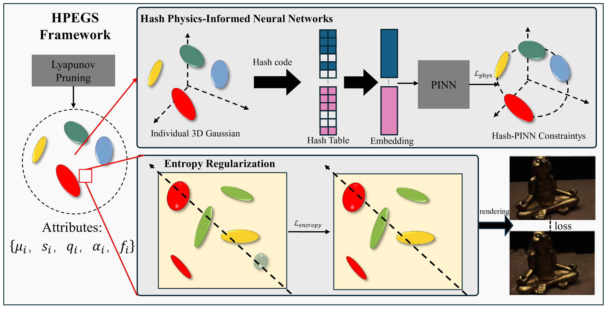

# HPEGS: Unified Hash Physics-Informed Neural Network and Entropy Regularization in Gaussian Splatting for sparse view synthesis

This is the official repository for our ECCV 2026 paper **HPEGS: Unified Hash Physics-Informed Neural Network and Entropy Regularization in Gaussian Splatting for sparse view synthesis**.




## Installation

Tested on Ubuntu 22.04, CUDA 11.3, PyTorch 1.12.1

``````
conda env create --file environment.yml
conda activate hpegs

cd submodules
git clone git@github.com:ashawkey/diff-gaussian-rasterization.git --recursive
git clone https://gitlab.inria.fr/bkerbl/simple-knn.git
pip install ./diff-gaussian-rasterization ./simple-knn
``````

If encountering installation problem of the `diff-gaussian-rasterization` or `gridencoder`, you may get some help from [gaussian-splatting](https://github.com/graphdeco-inria/gaussian-splatting) and [torch-ngp](https://github.com/ashawkey/torch-ngp).


## Evaluation


### DTU

1. Download DTU dataset

   - Download the DTU dataset "Rectified (123 GB)" from the [official website](https://roboimagedata.compute.dtu.dk/?page_id=36/), and extract it.
   - Download masks (used for evaluation only) from [this link](https://drive.google.com/drive/folders/1OEmJcbP0XUVfG647mdYWxEy9yOw7L_Si?usp=drive_link) (backed up from RegNeRF).


2. Organize DTU for few-shot setting

   ```bash
   bash scripts/organize_dtu_dataset.sh $rectified_path
   ```

3. Format

   - Poses: following [gaussian-splatting](https://github.com/graphdeco-inria/gaussian-splatting), run `convert.py` to get the poses and the undistorted images by COLMAP.
   - Render Path: following [LLFF](https://github.com/Fyusion/LLFF) to get the `poses_bounds.npy` from the COLMAP data. (Optional)


4. Generate monocular depths by DPT:

   ```bash
   cd dpt
   python get_depth_map_for_llff_dtu.py --root_path $<dataset_path_for_dtu> --benchmark DTU
   ```

5. Set the mask path and the expected output model path in `copy_mask_dtu.sh` for evaluation. (default: "data/dtu/submission_data/idrmasks" and "output/dtu") 

6. Start training and testing:

   ```bash
   # for example
   bash scripts/run_dtu.sh data/dtu/scan8 output/dtu/scan8 ${gpu_id}
   ```


## Reproducing Results
Due to the randomness of the densification process and random initialization, the metrics may be unstable in some scenes, especially PSNR.


### MVS Point Cloud Initialization

If more stable performance is needed, we recommend trying the dense initialization from [FSGS](https://github.com/VITA-Group/FSGS).

Here we provide an example script for LLFF that just modifies a few hyperparameters to adapt our method to this initialization:

```bash
# Following FSGS to get the "data/llff/$<scene>/3_views/dense/fused.ply" first
bash scripts/run_llff_mvs.sh data/llff/$<scene> output_dense/$<scene> ${gpu_id}
```

However, there may still be some randomness.

For reference, the best results we get in two random tests are as follows:

| PSNR   | LPIPS  | SSIM  |
| ------ | ------ | ----- | 
| 22.272 | 0.087  | 0.901 | 


## Acknowledgement

This code is developed on [gaussian-splatting](https://github.com/graphdeco-inria/gaussian-splatting) with [simple-knn](https://gitlab.inria.fr/bkerbl/simple-knn) and a modified [diff-gaussian-rasterization](https://github.com/ashawkey/diff-gaussian-rasterization). The implementation of neural renderer are based on [torch-ngp](https://github.com/ashawkey/torch-ngp). Codes about [DPT](https://github.com/isl-org/MiDaS) are partial from [SparseNeRF](https://github.com/Wanggcong/SparseNeRF). Thanks for these great projects!
